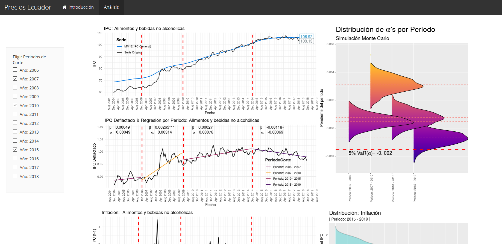
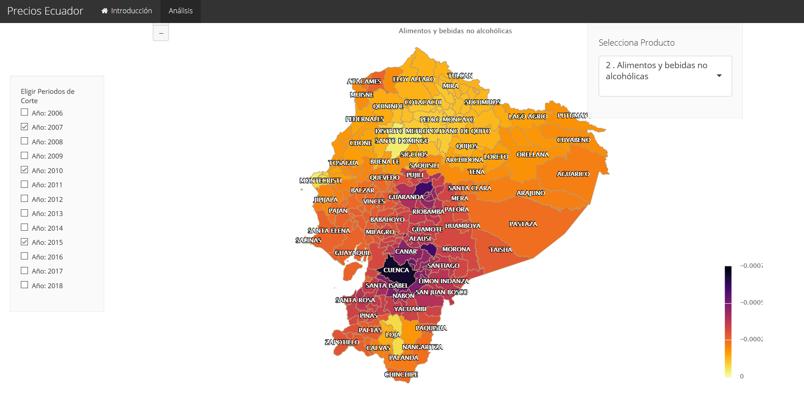

# Proyecto de Investigación

## Indicadores de Vulnerabilidad

Bajo la dinámica de capitalismo subdesarrollado, además de una marcada 
concentración  en ciudades como Quito, Guayaquil y Cuenca, la población 
del Ecuador se ubica principalmente a lo largo de las principales vías 
principales, en los valles interandinos y cerca de los cauces fluviales 
de la costa y el oriente; de modo que el "territorio" parece estructurado 
por una red de ciudades, intermedias entre cabeceras cantonales y 
parroquiales, articuladas a través de las vías de comunicación, esbozando 
un escenario en el que evidentes desigualdades -dentro y entre- han 
llevado a considerar distintas alternativas de desarrollo; entre ellas, 
el fortalecimiento de los vínculos urbano rurales, tanto al interior de 
las provincias como entre ellas.

Por otro lado, la formación de los precios y sus fluctuaciones son una 
manifestación del sistema de producción, comercialización y venta presente 
en los territorios y entre estos.

En este contexto, ubicar en la matriz de polarización social y de 
concentración de los medios de producción precapitalistas como son la 
tierra, los recursos y el control de comercio, pasa a ser parte de un 
proceso de concentración capitalista moderno que se refuerza y reproduce 
de manera ampliada a través del mercado, por lo tanto, los precios 
reflejan una microfísica del poder en cada localidad, además de reflejar 
a nivel macro una correlación de fuerzas entre distintos capitales. 
En ese sentido el poder de mercado de los distintos capitales define 
cual es la evolución de los precios relativos y por tanto reproduce de 
también manera ampliada las asimetrías estructurales en lo que tiene que 
ver con la distribución de la riqueza, del ingreso y de los recursos.

En la medida en la que la política estatal persigue el bien común tanto 
desde el gobierno central como desde los gobiernos seccionales, se tiende 
a reducir esos niveles estructurales de asimetría, pero el mercado los 
reproduce aceleradamente, es decir, "la plata llama a la plata".

Mientras mayores son los capitales involucrados estos tienden a 
concentrarse en los nichos de mercado que son más rentables, que pueden 
defender mejor sus precios, y el poder de mercado les permite sea a 
través de precios, cantidades o calidades siempre quedarse con la mejor parte.

Por otro lado, existe todo un gradiente de productores menores, inclusive 
capitalistas, tanto urbanos como rurales, que pueden defender sus precios 
relativos a una escala mucho menor que los más grandes. Y al final de esta 
cadena se encuentran los pequeños productores, los campesinos, los artesanos, 
y demás miembros de la economía popular y solidaria, quienes no tienen poder 
de mercado, pero conforman el grueso del aparato productivo del país y que al
ser vulnerables a pequeñas fluctuaciones en los precios, su situación económica 
debe ser prioridad de las políticas públicas locales y nacionales.

Es así que surge la necesidad de contar con herramientas adecuadas que nos 
permitan ubicar de manera temprana, posibles sectores productivos en riesgo,
situación que como ya mencionamos afectaría principalmente a los pequeños
productores de la Economía Popular y Solidaria , y largo plazo escalaría otros sectores, 
y a la poste a nivel nacional. Con ese objetivo proponemos 
la construcción de indicadores de alerta temprana de los sectores productivos en el 
territorio provincial y cantonal. Partiremos de la reconstrucción la serie del Indice 
de precios al Consumidor (IPC) para todos los cantones del Ecuador, para ello haremos
uso de dos modelos, por una parte un modelo termodinámico, que estime el IPC de
determinado cantón como una función del IPC de cantones aledaños, y por otra parte
un modelo gravitacional, que además considere en la estimación a la masa económica 
(VAB) de cada cantón. 

A partir de lo anterior construimos un índice compuesto, proporcional al Índice de
Precios al Productor (IPP), pero inversamente proporcional al IPC estimado localmente,
así este indicador condensaría la relación Productor - Consumidor, que nos permitiría
identificar sectores en riesgo.

**Palabras Clave:** Modelo Gravitacional, Modelo Termodinámico, Indicadores regionales, Indicadores compuestos, Modelos de Riesgo.

### Capturas de Pantalla APP

 

 

